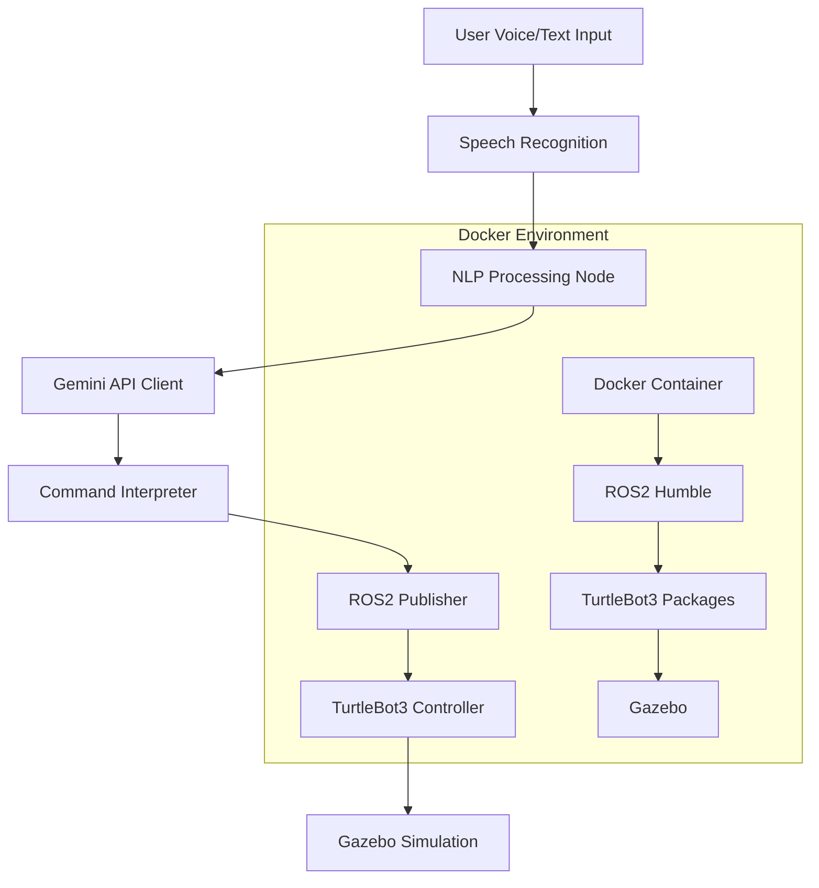

# Design Document

## Overview

This system implements a natural language processing interface for controlling TurtleBot3 robot in Gazebo simulation using Gemini API. The architecture consists of a Docker-based ROS2 environment, a Python-based NLP processing node, voice input handling, and robot control command generation.

## Architecture

The system follows a modular architecture with the following main components:



## Components and Interfaces

### 1. Docker Environment Setup
- **Base Image**: Ubuntu 22.04 LTS
- **ROS2 Distribution**: Humble
- **Python Version**: 3.10.6
- **Key Packages**: 
  - ros-humble-desktop
  - ros-humble-turtlebot3*
  - ros-humble-gazebo-*
  - python3-pip
  - Additional Python packages for speech recognition and API integration

### 2. Natural Language Processing Node (`nlp_controller.py`)
- **Purpose**: Main ROS2 node that handles NLP processing and robot control
- **Interfaces**:
  - Input: Voice/text commands
  - Output: geometry_msgs/Twist messages to `/cmd_vel` topic
- **Dependencies**: 
  - rclpy
  - google-generativeai (Gemini API client)
  - speech_recognition
  - pyaudio

### 3. Gemini API Integration
- **Client Library**: google-generativeai
- **Model**: gemini-pro or gemini-pro-vision
- **Prompt Engineering**: Structured prompts to convert natural language to robot commands
- **Response Format**: JSON structure with movement parameters (linear_x, angular_z, duration)

### 4. Speech Recognition Module
- **Library**: SpeechRecognition with Google Speech API
- **Audio Input**: PyAudio for microphone capture
- **Language Support**: Japanese and English
- **Fallback**: Text input when voice recognition fails

### 5. Command Interpreter
- **Input**: Gemini API response (JSON format)
- **Output**: ROS2 Twist messages
- **Validation**: Command safety checks and parameter bounds
- **Mapping**: Natural language concepts to robot motion parameters

### 6. Robot Control Interface
- **Publisher**: `/cmd_vel` topic (geometry_msgs/Twist)
- **Message Structure**:
  ```python
  linear.x: forward/backward velocity (-1.0 to 1.0 m/s)
  linear.y: 0 (not used for differential drive)
  linear.z: 0 (not used for ground robot)
  angular.x: 0 (not used)
  angular.y: 0 (not used)
  angular.z: rotation velocity (-2.0 to 2.0 rad/s)
  ```

## Data Models

### Command Structure
```python
class RobotCommand:
    command_type: str  # "move", "turn", "stop"
    linear_velocity: float  # m/s
    angular_velocity: float  # rad/s
    duration: float  # seconds
    description: str  # human-readable description
```

### Gemini API Request Format
```json
{
    "prompt": "Convert this natural language command to robot control: '{user_command}'. Respond with JSON format: {\"command_type\": \"move/turn/stop\", \"linear_velocity\": float, \"angular_velocity\": float, \"duration\": float, \"description\": \"string\"}",
    "model": "gemini-pro"
}
```

### Configuration Structure
```python
class Config:
    gemini_api_key: str
    max_linear_velocity: float = 0.5
    max_angular_velocity: float = 1.0
    default_duration: float = 2.0
    voice_recognition_timeout: float = 5.0
    language: str = "ja-JP"  # or "en-US"
```

## Error Handling

### API Error Handling
- **Connection Errors**: Retry mechanism with exponential backoff
- **Authentication Errors**: Clear error messages for invalid API keys
- **Rate Limiting**: Queue management for API requests
- **Timeout Handling**: Fallback to previous command or stop

### Voice Recognition Error Handling
- **No Audio Detected**: Prompt user to speak again
- **Recognition Failure**: Fallback to text input mode
- **Microphone Issues**: Clear error messages and troubleshooting steps

### Robot Control Error Handling
- **Invalid Commands**: Safety bounds checking
- **ROS2 Connection Issues**: Node health monitoring
- **Simulation Crashes**: Graceful shutdown and restart procedures

## Testing Strategy

### Unit Tests
- **Gemini API Client**: Mock API responses and test parsing
- **Command Interpreter**: Test natural language to command conversion
- **Voice Recognition**: Test with sample audio files
- **ROS2 Publisher**: Test message publishing and formatting

### Integration Tests
- **End-to-End Voice Control**: Record voice commands and verify robot movement
- **API Integration**: Test with real Gemini API calls
- **Docker Environment**: Test container startup and ROS2 functionality
- **Gazebo Simulation**: Test robot spawning and control in simulation

### System Tests
- **Performance Testing**: Measure response time from voice to robot movement
- **Reliability Testing**: Long-running tests with various commands
- **Error Recovery Testing**: Test system behavior under failure conditions
- **Multi-language Testing**: Test Japanese and English command recognition

### Docker Testing
- **Container Build**: Automated testing of Docker image creation
- **Environment Validation**: Test ROS2 and TurtleBot3 package installation
- **Port Mapping**: Test GUI forwarding for Gazebo visualization
- **Volume Mounting**: Test persistent storage for logs and configurations

## Deployment Configuration

### Docker Compose Setup
```yaml
version: '3.8'
services:
  turtlebot3-nlp:
    build: .
    environment:
      - DISPLAY=${DISPLAY}
      - GEMINI_API_KEY=${GEMINI_API_KEY}
    volumes:
      - /tmp/.X11-unix:/tmp/.X11-unix:rw
      - ./src:/workspace/src
    devices:
      - /dev/snd:/dev/snd  # Audio device access
    network_mode: host
```

### Environment Variables
- `GEMINI_API_KEY`: User-provided API key
- `TURTLEBOT3_MODEL`: burger/waffle/waffle_pi
- `GAZEBO_MODEL_PATH`: Path to TurtleBot3 models
- `ROS_DOMAIN_ID`: ROS2 domain identifier

## Security Considerations

### API Key Management
- Environment variable storage (not hardcoded)
- Docker secrets for production deployment
- API key validation on startup

### Input Validation
- Command parameter bounds checking
- Malicious input filtering
- Rate limiting for API calls

### Network Security
- Container network isolation
- Minimal port exposure
- Secure API communication (HTTPS)

## Performance Optimization

### Response Time Optimization
- Async API calls to Gemini
- Command caching for repeated requests
- Optimized voice recognition settings

### Resource Management
- Memory usage monitoring
- CPU usage optimization for real-time control
- Docker resource limits configuration

### Scalability Considerations
- Multiple robot support architecture
- Distributed processing capability
- Load balancing for API requests