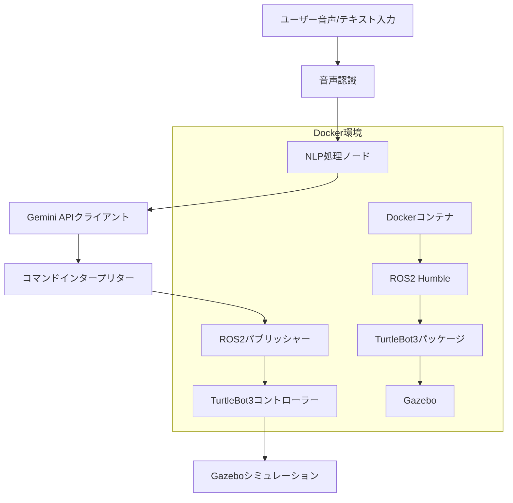

# 設計仕様書

## 概要

このシステムは、Gemini APIを使用してGazeboシミュレーション内のTurtleBot3ロボットを制御する自然言語処理インターフェースを実装します。アーキテクチャは、DockerベースのROS2環境、PythonベースのNLP処理ノード、音声入力処理、およびロボット制御コマンド生成で構成されています。

## アーキテクチャ

システムは以下の主要コンポーネントを持つモジュラーアーキテクチャに従います：



## コンポーネントとインターフェース

### 1. Docker環境セットアップ
- **ベースイメージ**: Ubuntu 22.04 LTS
- **ROS2ディストリビューション**: Humble
- **Pythonバージョン**: 3.10.6
- **主要パッケージ**: 
  - ros-humble-desktop
  - ros-humble-turtlebot3*
  - ros-humble-gazebo-*
  - python3-pip
  - 音声認識とAPI統合用の追加Pythonパッケージ

### 2. 自然言語処理ノード (`nlp_controller.py`)
- **目的**: NLP処理とロボット制御を処理するメインROS2ノード
- **インターフェース**:
  - 入力: 音声/テキストコマンド
  - 出力: `/cmd_vel`トピックへのgeometry_msgs/Twistメッセージ
- **依存関係**: 
  - rclpy
  - google-generativeai (Gemini APIクライアント)
  - speech_recognition
  - pyaudio

### 3. Gemini API統合
- **クライアントライブラリ**: google-generativeai
- **モデル**: gemini-proまたはgemini-pro-vision
- **プロンプトエンジニアリング**: 自然言語をロボットコマンドに変換する構造化プロンプト
- **レスポンス形式**: 移動パラメータ（linear_x、angular_z、duration）を含むJSON構造

### 4. 音声認識モジュール
- **ライブラリ**: Google Speech APIを使用したSpeechRecognition
- **音声入力**: マイクキャプチャ用のPyAudio
- **言語サポート**: 日本語と英語
- **フォールバック**: 音声認識が失敗した場合のテキスト入力

### 5. コマンドインタープリター
- **入力**: Gemini APIレスポンス（JSON形式）
- **出力**: ROS2 Twistメッセージ
- **バリデーション**: コマンド安全性チェックとパラメータ境界
- **マッピング**: 自然言語概念からロボット動作パラメータへの変換

### 6. ロボット制御インターフェース
- **パブリッシャー**: `/cmd_vel`トピック（geometry_msgs/Twist）
- **メッセージ構造**:
  ```python
  linear.x: 前進/後退速度（-1.0から1.0 m/s）
  linear.y: 0（差動駆動では使用しない）
  linear.z: 0（地上ロボットでは使用しない）
  angular.x: 0（使用しない）
  angular.y: 0（使用しない）
  angular.z: 回転速度（-2.0から2.0 rad/s）
  ```

## データモデル

### コマンド構造
```python
class RobotCommand:
    command_type: str  # "move", "turn", "stop"
    linear_velocity: float  # m/s
    angular_velocity: float  # rad/s
    duration: float  # 秒
    description: str  # 人間が読める説明
```

### Gemini APIリクエスト形式
```json
{
    "prompt": "この自然言語コマンドをロボット制御に変換してください: '{user_command}'。JSON形式で応答してください: {\"command_type\": \"move/turn/stop\", \"linear_velocity\": float, \"angular_velocity\": float, \"duration\": float, \"description\": \"string\"}",
    "model": "gemini-pro"
}
```

### 設定構造
```python
class Config:
    gemini_api_key: str
    max_linear_velocity: float = 0.5
    max_angular_velocity: float = 1.0
    default_duration: float = 2.0
    voice_recognition_timeout: float = 5.0
    language: str = "ja-JP"  # または "en-US"
```

## エラーハンドリング

### APIエラーハンドリング
- **接続エラー**: 指数バックオフ付きリトライメカニズム
- **認証エラー**: 無効なAPIキー用の明確なエラーメッセージ
- **レート制限**: APIリクエスト用のキュー管理
- **タイムアウト処理**: 前のコマンドまたは停止へのフォールバック

### 音声認識エラーハンドリング
- **音声が検出されない**: ユーザーに再度話すよう促す
- **認識失敗**: テキスト入力モードへのフォールバック
- **マイク問題**: 明確なエラーメッセージとトラブルシューティング手順

### ロボット制御エラーハンドリング
- **無効なコマンド**: 安全性境界チェック
- **ROS2接続問題**: ノードヘルス監視
- **シミュレーションクラッシュ**: 適切なシャットダウンと再起動手順

## テスト戦略

### 単体テスト
- **Gemini APIクライアント**: モックAPIレスポンスと解析テスト
- **コマンドインタープリター**: 自然言語からコマンド変換のテスト
- **音声認識**: サンプル音声ファイルでのテスト
- **ROS2パブリッシャー**: メッセージパブリッシュとフォーマットのテスト

### 統合テスト
- **エンドツーエンド音声制御**: 音声コマンドを記録しロボット移動を検証
- **API統合**: 実際のGemini API呼び出しでのテスト
- **Docker環境**: コンテナ起動とROS2機能のテスト
- **Gazeboシミュレーション**: シミュレーション内のロボットスポーンと制御のテスト

### システムテスト
- **パフォーマンステスト**: 音声からロボット移動までの応答時間測定
- **信頼性テスト**: 様々なコマンドでの長時間実行テスト
- **エラー回復テスト**: 失敗条件下でのシステム動作テスト
- **多言語テスト**: 日本語と英語コマンド認識のテスト

### Dockerテスト
- **コンテナビルド**: Dockerイメージ作成の自動化テスト
- **環境検証**: ROS2とTurtleBot3パッケージインストールのテスト
- **ポートマッピング**: Gazebo可視化用GUIフォワーディングのテスト
- **ボリュームマウント**: ログと設定用永続ストレージのテスト

## デプロイメント設定

### Docker Composeセットアップ
```yaml
version: '3.8'
services:
  turtlebot3-nlp:
    build: .
    environment:
      - DISPLAY=${DISPLAY}
      - GEMINI_API_KEY=${GEMINI_API_KEY}
    volumes:
      - /tmp/.X11-unix:/tmp/.X11-unix:rw
      - ./src:/workspace/src
    devices:
      - /dev/snd:/dev/snd  # オーディオデバイスアクセス
    network_mode: host
```

### 環境変数
- `GEMINI_API_KEY`: ユーザー提供のAPIキー
- `TURTLEBOT3_MODEL`: burger/waffle/waffle_pi
- `GAZEBO_MODEL_PATH`: TurtleBot3モデルへのパス
- `ROS_DOMAIN_ID`: ROS2ドメイン識別子

## セキュリティ考慮事項

### APIキー管理
- 環境変数ストレージ（ハードコードしない）
- 本番デプロイメント用のDockerシークレット
- 起動時のAPIキーバリデーション

### 入力バリデーション
- コマンドパラメータ境界チェック
- 悪意のある入力フィルタリング
- API呼び出しのレート制限

### ネットワークセキュリティ
- コンテナネットワーク分離
- 最小限のポート露出
- セキュアなAPI通信（HTTPS）

## パフォーマンス最適化

### 応答時間最適化
- Geminiへの非同期API呼び出し
- 繰り返しリクエスト用のコマンドキャッシュ
- リアルタイム制御用の最適化された音声認識設定

### リソース管理
- メモリ使用量監視
- リアルタイム制御用のCPU使用量最適化
- Dockerリソース制限設定

### スケーラビリティ考慮事項
- 複数ロボットサポートアーキテクチャ
- 分散処理機能
- APIリクエスト用のロードバランシング 